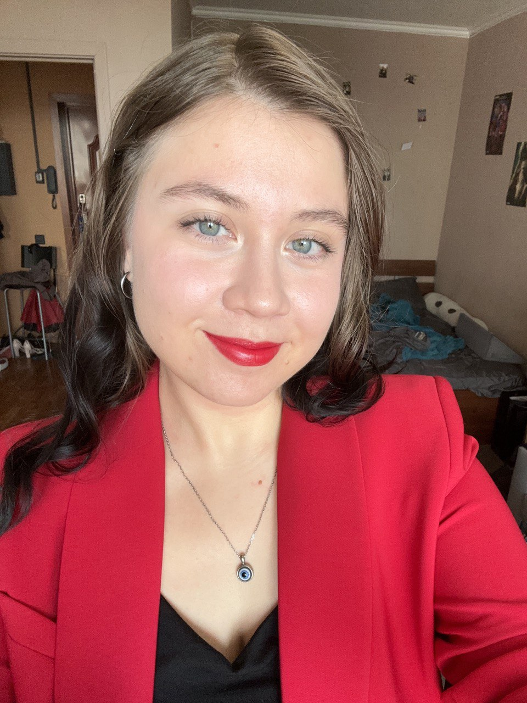

# Kamila Urusova
**Contact information:** +7 (995) 170-41-40 / kamilaurusova7@gmail.com / discord: [Kamila Urusova (@kqmilv)](https://discord.com/users/turka5599)

## About Me
I am a fourth-year student majoring in Hotel Management, currently transitioning into front-end development. I am highly motivated to learn and acquire new skills in web development, with a strong focus on building modern, responsive websites. I am fluent in English (C1), and my native languages are Russian and Turkish. I am also learning Spanish and have basic knowledge of German and Chinese. My main strength is my ability to learn quickly, adapt to new technologies, and work diligently to achieve my goals.

## Skills
- **Languages:** HTML, CSS, JavaScript (beginner level)
- **Frameworks/libraries:**  -
- **Version control:** Basic knowledge of Git
- **Other:** Strong communication skills, multilingual, fast learner, motivated to develop as a front-end developer

## Code Example
```javascript
function multiply(a, b) {
  return a * b;
}

// Example
console.log(multiply(2, 3)); // Output: 6
```

## Work Experience
- **Completed projects:** [CV project](https://github.com/kqmilv/rsschool-cv)
- **Skills used:** Markdown, Git, HTML, CSS
- **Description:** Created a CV using Markdown markup language and then styled it using HTML and CSS

## Education
- **Bachelor’s degree in Hotel Management (4th year student)**
    - RANEPA, Moscow, 2026
- **Self-learning:** Front-end development (HTML, CSS, JavaScript basics)
- **Online courses/tutorials:** Rolling Scopes School, YouTube, Codewars

## English Language
- **Proficiency level:** C1 (fluent)